# 🏗️ Arquitectura Híbrida: Servidor Local + Supabase

## 📋 Resumen Ejecutivo

Sistema de torneo de Scrabble Duplicado que combina:
- **Servidor Local**: Control del torneo, generación de atriles, lógica del juego
- **Supabase**: Receptor de jugadas, persistencia, manejo de concurrencia
- **Escalabilidad**: Soporta 50+ jugadores simultáneos sin cuellos de botella

## 🎯 Flujo del Sistema

```mermaid
graph LR
    A[50+ Jugadores] -->|Envían jugadas| B[Supabase PostgreSQL]
    B -->|Polling 500ms| C[Servidor Local]
    C -->|Procesa y valida| D[Estado en Memoria]
    C -->|Control| E[Torneo/Rondas/Timer]
    D -->|Rankings| A
```



## 🔄 Flujo Detallado

### 1. **Inicio del Torneo**
```bash
./start_tournament.sh
```
- Verifica conexión a Supabase
- Compila el servidor
- Inicia polling automático

### 2. **Inscripción de Jugadores**
- Jugadores acceden a: `http://IP:8080/player_supabase.html?tournament_id=XXX`
- Se inscriben con su nombre (servidor local)
- Reciben su player_id

### 3. **Envío de Jugadas**
```javascript
// player_supabase.html envía DIRECTO a Supabase
await supabase.from('player_plays').insert({
    tournament_id: 'xxx',
    player_id: 'yyy',
    round_number: 1,
    word: 'CASA',
    position_row: 7,
    position_col: 7,
    position_down: false
});
```

### 4. **Procesamiento (Servidor)**
```rust
// supabase_poller.rs - Cada 500ms
1. Lee jugadas nuevas desde Supabase
2. Valida con motor Wolges
3. Actualiza estado en memoria
4. Marca como procesada en Supabase
```

### 5. **Feedback a Jugadores**
- Servidor actualiza rankings
- Jugadores consultan estado vía API local
- Al final de ronda: revela jugada óptima

## 🚀 Ventajas de esta Arquitectura

| Aspecto | Beneficio |
|---------|-----------|
| **Sin cuellos de botella** | Jugadores → Supabase (infraestructura escalable) |
| **Multi-red** | WiFi local + datos móviles simultáneamente |
| **Resiliente** | Si falla WiFi, jugadores usan 4G/5G |
| **Baja latencia local** | Servidor procesa en memoria |
| **Persistencia** | Todo queda en Supabase para reportes |
| **Sin IP fija** | Supabase URL es constante |

## 📁 Archivos Clave

### Frontend
- `player_supabase.html` - Interfaz del jugador con Supabase SDK
- `index.html` - Panel de administración

### Backend
- `src/supabase_poller.rs` - Polling de jugadas desde Supabase
- `src/tournament_manager.rs` - Lógica del torneo
- `src/async_queue.rs` - Cola asíncrona (para escrituras)
- `src/local_cache.rs` - Cache en memoria

### Scripts
- `start_tournament.sh` - Inicio fácil del servidor
- `test_load_50_players.py` - Test de carga

## 🛠️ Configuración

### 1. Variables de Entorno (.env)
```env
SUPABASE_URL=https://xxx.supabase.co
SUPABASE_ANON_KEY=eyJ...
DATABASE_URL=postgresql://...
```

### 2. Schema de Supabase
```sql
-- Tabla player_plays con columna 'processed'
ALTER TABLE player_plays 
ADD COLUMN processed BOOLEAN DEFAULT false;

CREATE INDEX idx_player_plays_processed 
ON player_plays(processed, submitted_at);
```

## 📊 Monitoreo en Tiempo Real

### Endpoints de Monitoreo
- `/api/metrics` - Métricas de la cola asíncrona
- `/api/health` - Health check del sistema
- `/api/cache/stats` - Estado del cache local

### Ejemplo de Métricas
```json
{
  "queue_metrics": {
    "total_submitted": 150,
    "total_processed": 148,
    "avg_latency_ms": 45.2,
    "queue_size": 2
  }
}
```

## 🌐 Acceso desde Internet (ngrok)

Para torneos con jugadores remotos:

```bash
# Terminal 1: Servidor
./start_tournament.sh

# Terminal 2: Túnel público
ngrok http 8080

# Compartir link:
https://abc123.ngrok-free.app/player_supabase.html?tournament_id=XXX
```

## ⚡ Rendimiento Esperado

| Métrica | Valor |
|---------|-------|
| Jugadores concurrentes | 50-200+ |
| Latencia promedio | < 100ms |
| Procesamiento jugada | < 50ms |
| Polling interval | 500ms |
| Cache capacity | 10,000 jugadas |

## 🔧 Troubleshooting

### Problema: Jugadas no se procesan
```bash
# Verificar columna processed
psql $DATABASE_URL -c "SELECT COUNT(*) FROM player_plays WHERE processed = false;"

# Ver logs del servidor
RUST_LOG=debug ./target/release/wolges-tournament-server
```

### Problema: Alta latencia
```bash
# Revisar métricas
curl http://localhost:8080/api/metrics

# Ajustar polling interval en main.rs
500 → 250 // ms
```

## 📈 Próximas Mejoras

1. **WebSockets/Realtime** - Reemplazar polling con subscripciones
2. **Queue prioritaria** - Procesar jugadas críticas primero
3. **Sharding** - Múltiples servidores para mega-torneos
4. **Analytics** - Dashboard de estadísticas en tiempo real

---

**Arquitectura diseñada para**: Torneos presenciales con 50+ jugadores usando múltiples redes (WiFi + móvil) sin cuellos de botella ni dependencia de IP local.